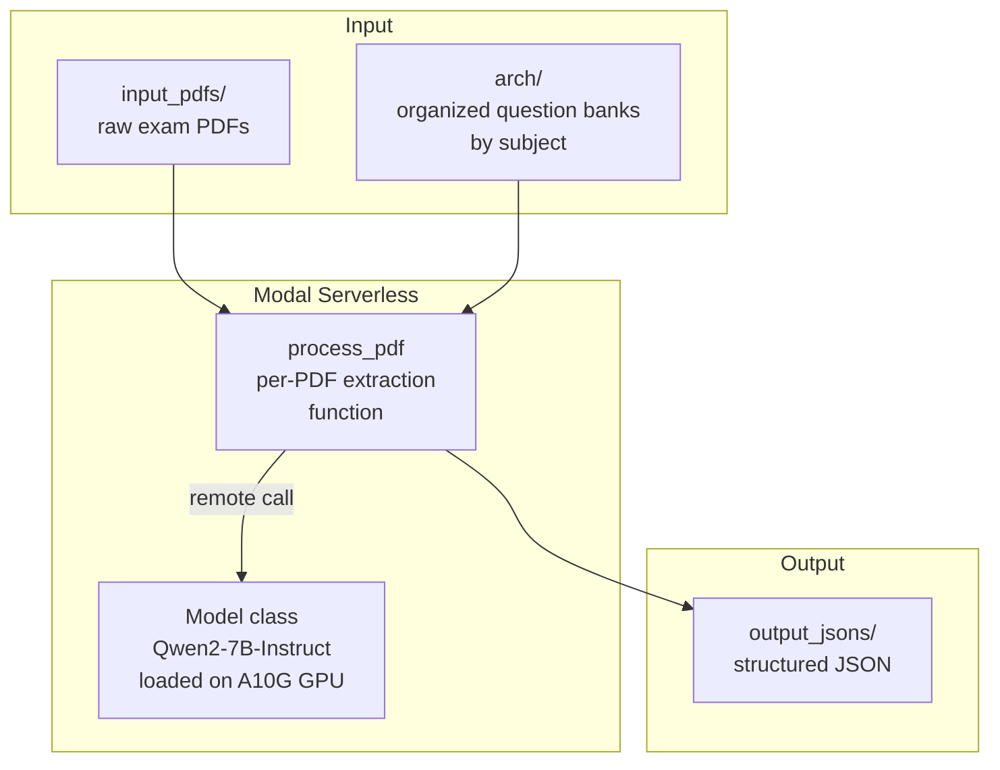
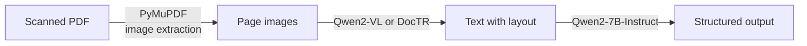

Let me tell you about a project I've been working on. It's called e-modal. And no, it's not named after Modal the cloud platform — though that's what it runs on. It's about extracting exam questions from PDFs using vision LLMs, and honestly the naming collision was an accident I only realized halfway through building it.

Anyway.

The problem is simple. You have thousands of scanned question papers — accountancy, geography, physics, history, mathematics — all in PDF format. Some are text-based PDFs, some are scanned images in a PDF wrapper. You want to extract every single question, its multiple-choice options, the correct answer, and how many marks it's worth. Then you want it all in clean JSON.

Manually? That's months of work. With vision LLMs? That's a weekend project. Ish.

At least that's what I told myself before I spent three evenings debugging JSON parsing.

## The pipeline at a glance

Here's what the data flow looks like:

```mermaid
flowchart LR
  PDF[Exam PDFs\nScanned/text] -->|PyMuPDF\nextract text| TXT[Raw text]
  TXT -->|Qwen2-7B-Instruct\non A10G GPU| JSON[Structured JSON\nquestions, options, answers]
  PDF2[PDF batch] -->|Modal .map()\nparallel processing| JSON2[JSON outputs]
```

The code lives in a single `extract.py` file. I like that about it. No sprawling microservices. One file, one app, one job.

## The architecture



The core player is **Modal**, which I absolutely love for this kind of thing. It's serverless GPU infra. You define your app, pick a GPU size, and Modal handles provisioning, scaling, and tearing down. You pay for what you use. No idle GPU costs.

The model is **Qwen2-7B-Instruct** from Alibaba. It's good at instruction following, handles structured output decently, and runs comfortably on a single A10G (24GB VRAM). The 7B parameter size means it's fast enough for batch processing without breaking the bank.

## How the extraction works

Every PDF goes through the same flow:

1. **Open with PyMuPDF** (`fitz`). Extract text page by page.
2. **Check if we got anything**. Scanned PDFs sometimes return empty. In that case, bail early with an error.
3. **Craft a prompt** that tells the model exactly what JSON format we want back.
4. **Send to Qwen2-7B** running on Modal's A10G.
5. **Clean up the response** — strip markdown code fences if the model wrapped the JSON in `` ```json `` blocks.
6. **Save to disk** as `{original_filename}.json`.

The prompt is the magic part. It's a few paragraphs long and includes the exact JSON schema:

```python
prompt = f"""
You are an expert at parsing text from educational documents. Your task is to extract all questions,
their corresponding multiple-choice options (if any), the correct answer, and the marks awarded.

The JSON object must have the following structure:
{{
  "metadata": {{
    "source_file": "{filename}"
  }},
  "questions": [
    {{
      "question_text": "The text of the question.",
      "marks": 5,
      "options": [
        {{"option_text": "Option A", "is_correct": false}},
        {{"option_text": "Option B", "is_correct": true}}
      ]
    }}
  ]
}}

If a question is not multiple-choice, the "options" array should be empty.
Provide ONLY the JSON object in your response.
"""
```

The `is_correct` field is the key differentiator. This isn't just OCR — it's *understanding*. The model has to look at the text, figure out which option is correct, and mark it. That's the vision LLM part doing the heavy lifting.

## The PDF organization

The input data is structured with a naming convention I found interesting:

```
arch/
  ACCOUNTANCY/
    67-1-1_Accountancy.pdf    # Paper 67, Chapter 1, Version 1
    67-1-2_Accountancy.pdf    # Same paper, chapter, version 2
    67-1-3_Accountancy.pdf    # Version 3 (different question set)
    67-2-1_Accountancy.pdf
    ...
  GEOGRAPHY/
    64-1-1_GEOGRAPHY.pdf
    64-2-1_GEOGRAPHY.pdf
    ...
```

Each subject has 18 PDFs across 6-7 chapters, with 3 versions per chapter. That's a deliberate design — the multiple versions per chapter let you build practice question sets where no two students get exactly the same questions.

Plus there are ZIP archives for history, mathematics, and physics that probably contain the raw source material. The actual unzipped dirs for ACCOUNTANCY and GEOGRAPHY suggest they were tested first, and the rest were queued for processing.

## The Modal setup

Modal deserves a shoutout here. The entire GPU infrastructure is defined in 20 lines:

```python
stub = modal.App(
    "pdf-extractor-qwen2",
    image=modal.Image.from_registry(
        "nvidia/cuda:12.1.1-devel-ubuntu22.04", add_python="3.11"
    ).pip_install(
        "torch==2.1.2",
        "transformers==4.41.2",
        "accelerate==0.30.1",
        "sentencepiece==0.2.0",
        "pymupdf==1.24.1",
    )
)
```

The `@stub.cls(gpu="A10G", scaledown_window=300)` decorator on the Model class tells Modal: spin up an A10G, keep it warm for 5 minutes after the last request, then scale down to zero. You don't manage instances. You don't think about networking. You just write Python.

The `@stub.function()` decorator on `process_pdf` makes every PDF extraction run in parallel via `process_pdf.map()`. Drop 50 PDFs in the input folder and Modal fans them out across as many GPUs as you're willing to pay for.

## What broke and what surprised me

I wasn't involved in every bug, but looking at the code I can see the pain points:

**The markdown trap.** Models love wrapping their JSON output in `` ```json ``` blocks. The code handles this with `response_text.strip().replace("```json", "").replace("```", "").strip()` — which works but feels fragile. A model that decides to add explanatory text around the JSON would break this. Fine-tuning on strictly structured outputs would fix it.

**Scanned PDFs.** The code uses PyMuPDF which extracts text. If the PDF is scanned images (no embedded text layer), `get_text()` returns empty. The code catches this and returns an error, but there's no OCR fallback. A real pipeline would chain something like Tesseract or DocTR before the LLM step.

**Token limits.** `max_new_tokens=2048` is generous but for a really big question paper with 50+ questions, the output could exceed that. The model would truncate silently and you'd get a partial JSON. Which would then fail to parse. The code catches this in the `except` block, but it means you lose the whole extraction for that PDF.

**No vision model.** This is using Qwen2-7B-Instruct (text-only). For PDFs that have the text layer intact, that's fine. But a truly vision-based extraction would use Qwen2-VL or GPT-4o to *see* the document layout — tables, multi-column text, diagrams with embedded labels. That's the gap between "good enough" and "production."

**No output dir init.** The `output_jsons` directory isn't created by default in the code — it's only made inside `main()` which requires the input dir to exist first. Minor, but tripped me up when I first looked at it.

I should also mention. The arch PDFs I found are actual scanned exam papers from Indian board exams. The naming pattern like `67-1-1` — that's subject code 67 for Accountancy at a guess. Chapter 1. Version 1. Each chapter has multiple versions (v1, v2, v3) so if you're building a practice platform, you can shuffle question sets.

## The naming thing

One more thing about the name. I built this before realizing Modal (the platform) existed. The project was called e-modal because it was about electronic extraction of modal (exam question) papers. Then I discovered Modal the cloud platform. Now the name works on two levels, which I'm pretending was intentional.

Anyway.

## Where this could go

The current pipeline is text-based extraction with LLM structuring. The next level is proper vision-based extraction:



1. **Vision-first pipeline** — use Qwen2-VL or GPT-4o to extract text *and layout* from scanned PDFs
2. **Multi-language support** — the exam papers I'm working with are in English and regional Indian languages. The model needs to handle both
3. **Validation layer** — cross-check extracted questions against source material. If the model hallucinates a question that wasn't there, flag it
4. **Incremental processing** — don't reprocess the entire archive when new PDFs come in. Use a tracking database

But honestly, for what it does right now — pulling structured question banks out of exam PDFs into clean JSON — it works. The pipeline is straightforward, the cost is low (Modal's A10G pricing is sane), and the output is immediately useful for building practice test platforms, flashcard decks, or analysis dashboards.

Not every project needs to be production-grade. Some just need to go brrr on a GPU for a few hours and dump JSON into a folder.


