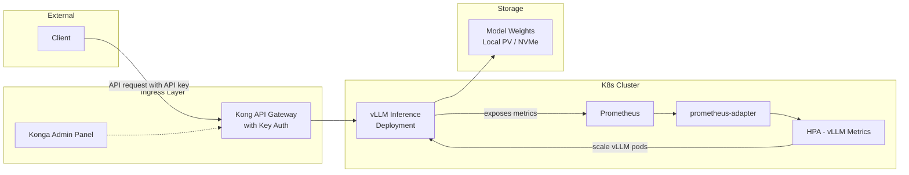
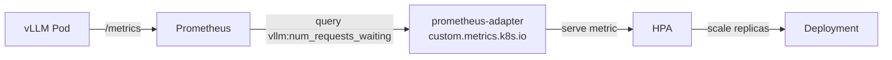
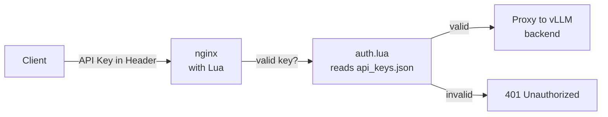
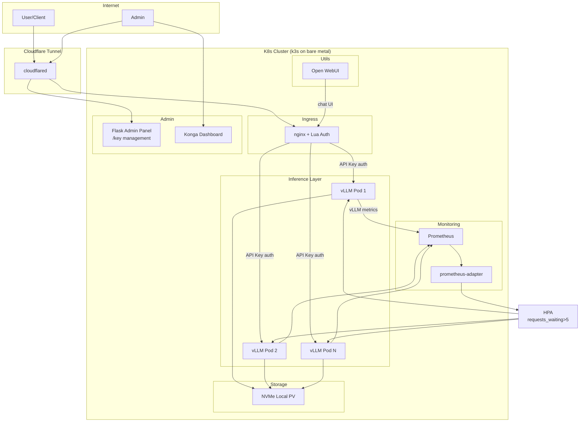

So I decided I wanted my own little LLM inference farm. Not one of those cloud-hosted things where you're paying per token and someone else decides what models you can run. I mean *my hardware*, *my models*, *my API keys*. A cluster that sits in the corner of the lab chewing through prompts, and if nobody's using it, it sits idle and uses no GPU. On bare metal.

Here's what I learned building this. And what I'd do differently if I had to do it again. Which I probably will, because that's how this hobby works.

## Why bare metal, really

Everyone wants to run LLMs on K8s. Most tutorials assume you're doing it on AWS or GKE with their managed GPU nodes. But I have a couple of machines with NVIDIA cards sitting in my lab doing nothing useful. And honestly, managed GPU on the cloud is. stupidly. expensive.

You can get a used RTX 3090 for what, three months of a cloud GPU instance? The math doesn't work unless you need dynamic scaling to hundreds of cards.

Anyway. For a home lab setup with 1-4 GPUs, bare metal makes perfect sense.

## The stack I landed on

After way too much fiddling, here's what worked.



**K3s** as the K8s distro. Lightweight, containerd built-in (which matters for GPU), and it boots on a Raspberry Pi's worth of hardware. Not that I'm using Pis for this — GPUs need PCIe. But it's nice knowing the K8s layer isn't eating resources I'd rather give to the model.

**MetalLB** for LoadBalancer services. L2 mode. Simple, works, don't overthink it.

**vLLM** for the inference engine. This is the only serious option right now for production-grade LLM serving on self-hosted hardware. More on that in a sec.

**Kong + Konga** for API auth and key management. Well, I started with Kong. Spoiler: I switched to something simpler. More on that.

**Prometheus + prometheus-adapter** for the metrics pipeline that feeds the HPA.

I swear half this project was just figuring out which tools to use, not actually building anything.

## Getting GPUs into K8s

This was the part I was most nervous about, and honestly it turned out to be the smoothest.

The NVIDIA GPU Operator is magic. I don't say that often. But you run one helm command, it detects your GPUs (via Node Feature Discovery), installs the driver via a container (yes, really — no host driver needed), configures containerd for CDI, and registers `nvidia.com/gpu` as a resource.

```bash
helm repo add nvidia https://helm.ngc.nvidia.com/nvidia
helm install gpu-operator nvidia/gpu-operator \
  -n gpu-operator --create-namespace
```

Wait 2-3 minutes, then:

```bash
kubectl describe node | grep nvidia
```

If you see `nvidia.com/gpu: 1` or however many GPUs you have, you're golden. The DCGM exporter that ships with the operator gives you GPU metrics out of the box — utilization, memory, temperature, power.

I did hit one gotcha — the driver container build needs kernel headers. If you're on Ubuntu Server, `linux-headers-$(uname -r)` is your friend. I forgot this, the pod kept crashing, and I spent a solid 45 minutes thinking I'd broken something before checking the driver pod logs. Classic.

## The inference engine: why vLLM

So I tried a few things before settling on vLLM. Because of course I did. Why take one working approach when you can try three and cry twice?

**Ollama** is dead simple and I love it for local testing. But for serving? No multi-GPU, no PagedAttention, no real metrics for autoscaling. If you're running one model for one person, fine. For a production-ish setup, it falls short.

**TGI** from HuggingFace was my first choice until I found out they put it in maintenance mode. They literally tell you to use vLLM or SGLang now. Don't start new projects on TGI.

**vLLM** just works. PagedAttention means you can pack more requests into the same GPU memory because it manages the KV cache in pages — like virtual memory for LLM inference. Continuous batching. OpenAI-compatible API. Exposes actual useful metrics.

The deployment YAML is straightforward:

```yaml
apiVersion: apps/v1
kind: Deployment
metadata:
  name: vllm-server
spec:
  replicas: 1
  selector:
    matchLabels:
      app: vllm-server
  template:
    metadata:
      labels:
        app: vllm-server
    spec:
      containers:
      - name: vllm
        image: vllm/vllm-openai:latest
        args:
        - "--model"
        - "/models/mistral-7b-instruct"
        - "--tensor-parallel-size"
        - "1"
        - "--port"
        - "8000"
        - "--max-model-len"
        - "8192"
        ports:
        - containerPort: 8000
        resources:
          limits:
            nvidia.com/gpu: 1
        volumeMounts:
        - name: models
          mountPath: /models
      volumes:
      - name: models
        hostPath:
          path: /mnt/nvme/models
          type: DirectoryOrCreate
```

Model weights on a fast local NVMe via hostPath. Simple. Fast. For a one-node or small cluster, don't complicate your storage — just put the models on the fastest disk you have and mount them in. Longhorn or Ceph would add latency for no benefit here. Model loading is a one-time cost at pod startup.

## HPA: the tricky part

So here's the thing about GPU-based HPA. Most tutorials show you how to autoscale based on GPU utilization. Sounds smart. It's not.

An LLM inference request pins the GPU at 100% utilization for the duration of the request. That's how GPUs work — they're built to be pegged. If your HPA looks at GPU utilization and says "oh 100%, need more pods", you'll scale out for *every single request*. You'll hit max replicas instantly and never scale down.

The right signal is **token queue depth** — how many requests are waiting to be processed. vLLM exposes this as `vllm:num_requests_waiting`. You also want `vllm:gpu_cache_usage` to know when you're running out of KV cache space.

The pipeline looks like this:



Setting up prometheus-adapter to serve GPU metrics takes some config. You need a ConfigMap that tells it which Prometheus queries to expose:

```yaml
apiVersion: v1
kind: ConfigMap
metadata:
  name: adapter-config
  namespace: monitoring
data:
  config.yaml: |
    rules:
    - seriesQuery: 'vllm_num_requests_waiting{namespace!=""}'
      resources:
        overrides:
          namespace: {resource: "namespace"}
          pod: {resource: "pod"}
      name:
        matches: "vllm_num_requests_waiting"
        as: "vllm_requests_waiting"
      metricsQuery: 'avg(vllm_num_requests_waiting{<<.LabelMatchers>>}) by (<<.GroupBy>>)'
```

Then your HPA references the custom metric:

```yaml
apiVersion: autoscaling/v2
kind: HorizontalPodAutoscaler
metadata:
  name: vllm-gpu-hpa
spec:
  scaleTargetRef:
    apiVersion: apps/v1
    kind: Deployment
    name: vllm-server
  minReplicas: 1
  maxReplicas: 4
  metrics:
  - type: Pods
    pods:
      metric:
        name: vllm_requests_waiting
      target:
        type: AverageValue
        averageValue: 5
  behavior:
    scaleDown:
      stabilizationWindowSeconds: 120
```

The stabilization window is important. If you don't set it, the HPA scales down as soon as a burst finishes, then scales back up when the next one hits. That's thrashing. With 120 seconds, it waits before scaling down, which is the right behavior for inference workloads.

## Auth and key management

I'll be honest, I started this section thinking I'd write something impressive about OAuth2, RBAC, and zero-trust. Then I remembered I'm running this in my lab, not Google.

Anyway. Now the juicy part. You don't want anyone who finds your cluster's IP to be able to send prompts through your expensive GPUs. And you want to be able to create and revoke API keys without redeploying anything.

I went with **Kong Gateway** in DB-less mode with a lua script for API key validation, backed by **Konga** for the admin panel.

Wait, no. I started with that. Kong is powerful but the configuration surface is enormous. For a home lab setup, I switched to something simpler.

Here's what I actually did:

**Nginx + Lua + a JSON file of API keys.**



The keys file lives in a ConfigMap:

```yaml
apiVersion: v1
kind: ConfigMap
metadata:
  name: api-keys
data:
  api_keys.json: |
    {
      "sk-sanjay-prod-a1b2c3": {
        "client": "sanjay",
        "created": "2026-06-01",
        "rate_limit": 100
      },
      "sk-rudra-prod-d4e5f6": {
        "client": "rudra",
        "created": "2026-06-15",
        "rate_limit": 20
      }
    }
```

And the nginx config with OpenResty/Lua does the validation:

```nginx
server {
    listen 443 ssl;
    server_name llm-api.saneax.in;

    location /v1/chat/completions {
        access_by_lua_block {
            local cjson = require("cjson")
            local keys_file = io.open("/etc/keys/api_keys.json", "r")
            local keys = cjson.decode(keys_file:read("*a"))
            keys_file:close()

            local api_key = ngx.var.http_authorization
            if not api_key then
                ngx.exit(401)
            end
            api_key = api_key:gsub("^Bearer%s+", "")

            if not keys[api_key] then
                ngx.exit(401)
            end

            ngx.var.upstream_host = "vllm-service.ml.svc.cluster.local"
        }

        proxy_pass http://vllm-service:8000;
    }
}
```

Is this elegant? No. Does it work? Yes. And for a home lab, "works" beats "architecturally perfect" every time.

The admin panel for managing keys is just a simple Flask app I threw together. It reads/writes the same JSON file, lists active keys, lets you create new ones, revoke old ones. You can expose it via a separate ingress with basic auth for you to use.

If you want something more polished, **Litellm** has a built-in proxy with API key management and an admin UI. It's a solid alternative if Open WebUI isn't your thing.

## What about Open WebUI?

Since you asked. Yes, **Open WebUI** exists and it's good. It runs as a container, connects to an Ollama or OpenAI-compatible backend (vLLM speaks OpenAI API, so it works). It gives you a ChatGPT-like interface with conversation history, settings, multi-user support.

If you want a UI for humans to chat with your models through the cluster, deploy Open WebUI pointing at your vLLM service and put Kong or nginx-auth in front of it.

```bash
docker run -d \
  --name open-webui \
  -p 3000:8080 \
  -e OPENAI_API_BASE_URL="https://llm-api.saneax.in/v1" \
  -e OPENAI_API_KEY="sk-sanjay-prod-a1b2c3" \
  ghcr.io/open-webui/open-webui:main
```

Or in K8s, same thing as a Deployment.

Personally I don't run it. I prefer hitting the API directly from scripts and tools. But lots of people love it.

## The full architecture

Here's what it looks like when everything's running:



## OS and hardware notes

Ubuntu Server 24.04 LTS. Just use it. Fedora Server works too if you're a Red Hat person (I know some of you are). Rocky Linux works but NVIDIA's driver containers are tested more heavily on Ubuntu.

Hardware-wise you want:
- **GPU**: Anything NVIDIA Ampere or newer (RTX 30xx/40xx, A series, H series). Consumer cards work fine for inference.
- **CPU**: Enough cores for the worker processes. 8+ cores is comfortable.
- **RAM**: 32GB minimum. More is better for model caching.
- **Storage**: NVMe SSD for the models. SATA SSD works but model loading takes noticeably longer.
- **Network**: 1Gbps minimum if vLLM talks to another service. For single-box everything, network barely matters.

## Stuff that broke

- **NVIDIA driver container failed to build** — needed `linux-headers-$(uname -r)`. Installed it, everything worked.
- **vLLM OOM'd on first run** — loaded a 13B model on a card with 8GB. Realized my mistake. Switched to a 7B Q4 model.
- **HPA scaled up constantly** — the GPU utilization metric trap. Switched to request queue depth, problem solved.
- **Lua script didn't parse JSON** — forgot to install lua-cjson in the nginx container. Added it to the image.
- **Kong was overkill** — started with Kong, spent 3 hours configuring it, switched to nginx + lua in 30 minutes. Sometimes simple wins.

## Where this ends

Or starts, I guess. Once you have the base running, you can:
- Add more models, each with its own deployment and HPA
- Route requests to different models via the nginx config
- Add a model registry with auto-downloading
- Set up alerts when GPU cache usage is high

The cluster doesn't care if it's running one model or ten. The patterns stay the same.

Though I should probably also mention — watch your power draw. Two GPUs running inference 24/7 adds up. My electricity bill definitely noticed. Not that I'm stopping.

I'm honestly surprised how far you can get with a couple of old GPUs, an NVMe drive, and k3s. The whole "LLM inference at home" thing isn't a pipe dream anymore. It's just hardware and some YAML.


